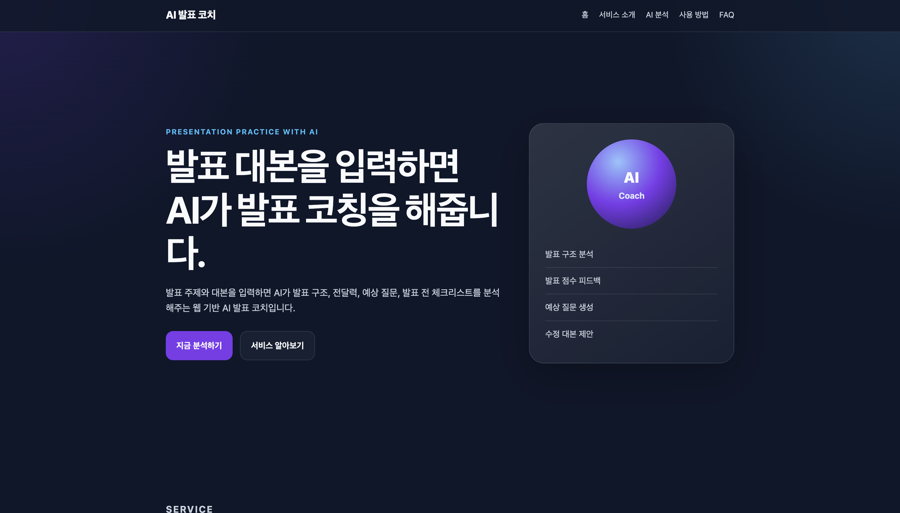
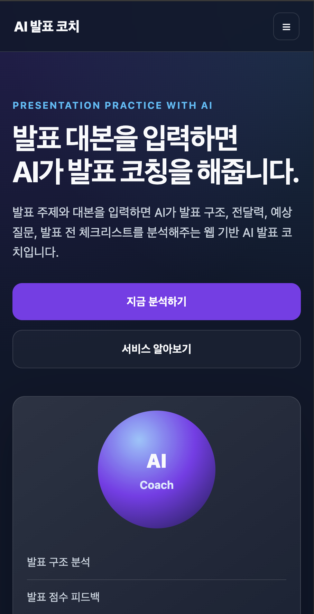
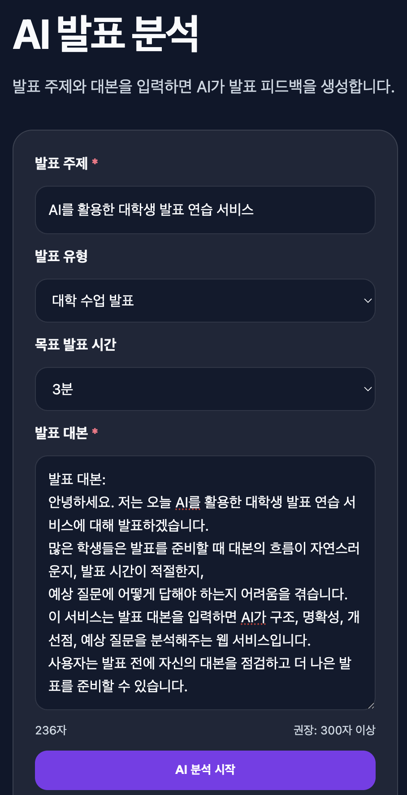
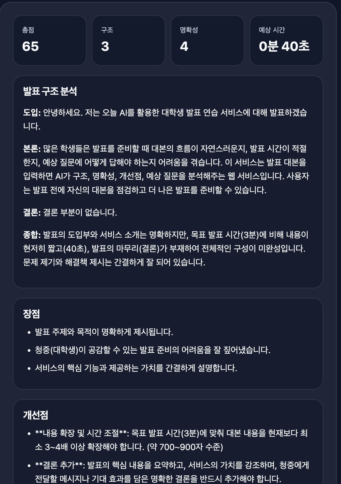
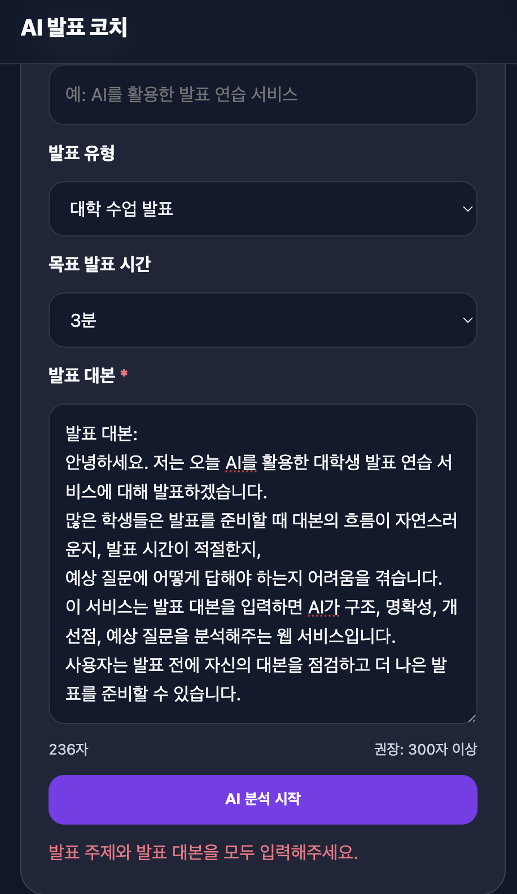
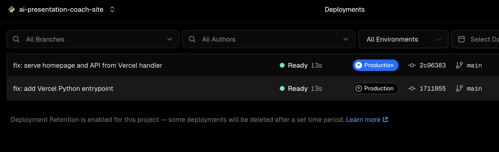
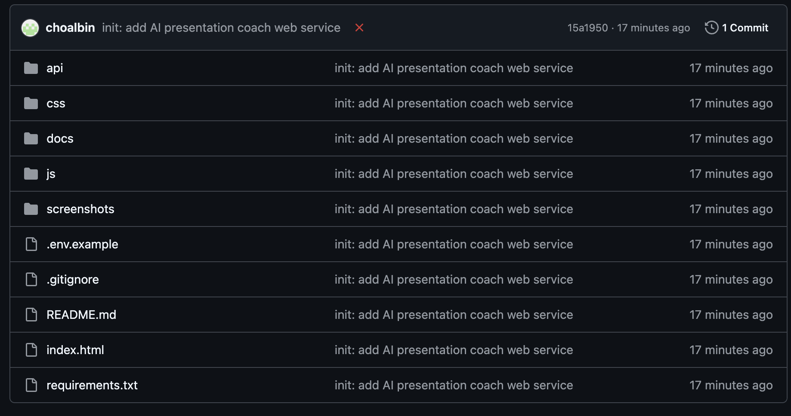
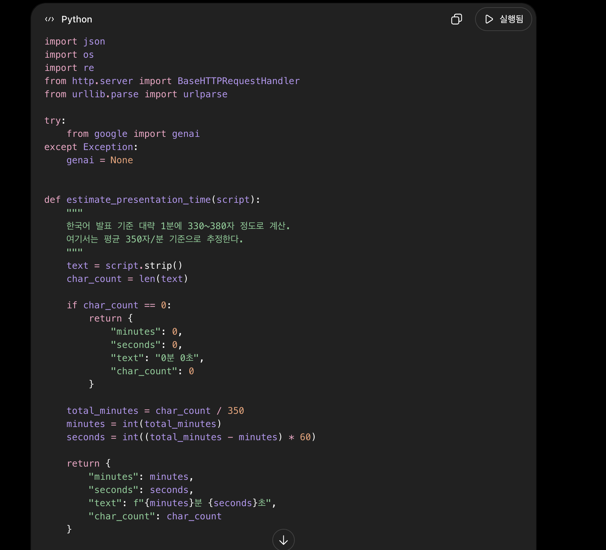

# AI 발표 코치 웹 서비스

## 1. 프로젝트 소개

AI 발표 코치는 사용자가 발표 주제와 발표 대본을 입력하면 AI가 발표 내용을 분석해주는 웹 서비스입니다.

발표를 준비하는 대학생이나 발표자가 자신의 대본을 미리 점검할 수 있도록 발표 구조, 명확성, 개선점, 예상 질문, 발표 전 체크리스트 등을 제공합니다.

이 프로젝트는 Vanilla HTML, CSS, JavaScript로 프론트엔드를 구성하고, Vercel Python Serverless Function을 이용해 Gemini API와 연동하는 방식으로 구현했습니다.

---

## 2. 배포 URL

배포된 웹 서비스 주소는 다음과 같습니다.

```text
https://ai-presentation-coach-site.vercel.app
```

---

## 3. 서비스 목적

발표를 준비할 때 많은 사용자는 다음과 같은 어려움을 겪습니다.

- 발표 대본의 구조가 자연스러운지 알기 어렵다.
- 발표 시간이 목표 시간에 맞는지 확인하기 어렵다.
- 발표 내용에서 어떤 점을 개선해야 하는지 스스로 판단하기 어렵다.
- 발표 후 받을 수 있는 예상 질문을 미리 준비하기 어렵다.

AI 발표 코치는 이러한 문제를 해결하기 위해 발표 대본을 입력받고, AI 분석 결과를 통해 발표 준비 과정을 도와주는 것을 목표로 합니다.

---

## 4. 대상 사용자

이 서비스의 주요 대상 사용자는 다음과 같습니다.

- 수업 발표를 준비하는 대학생
- 프로젝트 발표를 준비하는 팀원
- 면접 발표나 자기소개 발표를 준비하는 사용자
- 발표 대본을 미리 점검하고 싶은 사용자

---

## 5. 주요 기능

### 5.1 발표 대본 분석

사용자는 발표 주제, 발표 유형, 목표 발표 시간, 발표 대본을 입력할 수 있습니다.

입력된 내용은 백엔드 API로 전달되고, AI가 발표 내용을 분석합니다.

### 5.2 예상 발표 시간 계산

발표 대본의 글자 수를 기준으로 예상 발표 시간을 계산합니다.

한국어 발표 기준으로 약 1분당 350자 정도를 기준으로 추정했습니다.

### 5.3 AI 분석 결과 제공

AI는 다음 항목을 분석해 제공합니다.

- 발표 점수
- 발표 구조 분석
- 장점
- 개선점
- 수정 발표 대본
- 예상 질문과 답변
- 발표 전 체크리스트
- 한 문장 핵심 조언

### 5.4 오류 처리

사용자가 입력값을 비워두거나 대본이 너무 짧은 경우 오류 메시지를 출력합니다.

또한 AI API 호출에 실패하더라도 기본 분석 결과를 제공하는 fallback 로직을 추가했습니다.

---

## 6. 페이지 및 섹션 구성

이 웹 서비스는 하나의 랜딩 페이지 안에 여러 섹션을 구성했습니다.

| 섹션 | 설명 |
|---|---|
| Home | 서비스 이름과 핵심 소개 |
| Service | 서비스 목적 및 제공 기능 소개 |
| AI Coach | 발표 대본을 입력하고 AI 분석 결과를 받는 핵심 기능 |
| How to Use | 사용 방법 안내 |
| FAQ | 자주 묻는 질문 안내 |

---

## 7. 사용 기술

| 구분 | 사용 기술 |
|---|---|
| Frontend | HTML, CSS, JavaScript |
| Backend | Python, Vercel Serverless Function |
| AI API | Gemini API |
| Deployment | Vercel |
| Version Control | Git, GitHub |

---

## 8. 프로젝트 구조

```text
ai-presentation-coach-site/
├── index.html
├── css/
│   └── style.css
├── js/
│   └── main.js
├── api/
│   └── analyze.py
├── docs/
│   ├── service_plan.md
│   └── ai_coding_evidence.md
├── screenshots/
│   ├── 01_desktop_home.png
│   ├── 02_mobile_home.png
│   ├── 03_ai_input.png
│   ├── 04_ai_result.png
│   ├── 05_ai_error.png
│   ├── 06_vercel_deploy.png
│   ├── 07_github_repo.png
│   └── 08_ai_coding_process.png
├── requirements.txt
├── pyproject.toml
├── .env.example
├── .gitignore
└── README.md
```

---

## 9. AI 기능 설명

### 9.1 입력값

AI 분석 기능은 다음 입력값을 사용합니다.

| 입력 항목 | 설명 |
|---|---|
| 발표 주제 | 사용자가 발표하려는 주제 |
| 발표 유형 | 수업 발표, 프로젝트 발표, 면접 발표 등 |
| 목표 발표 시간 | 사용자가 목표로 하는 발표 시간 |
| 발표 대본 | 실제 발표에서 사용할 대본 |

### 9.2 출력값

AI 분석 결과는 다음 항목으로 구성됩니다.

| 출력 항목 | 설명 |
|---|---|
| 발표 점수 | 전체 점수, 구조, 명확성, 설득력, 전달력 점수 |
| 예상 발표 시간 | 대본 글자 수를 기준으로 계산한 발표 시간 |
| 발표 구조 분석 | 도입, 본론, 결론의 구성 분석 |
| 장점 | 발표 대본의 긍정적인 부분 |
| 개선점 | 보완하면 좋은 부분 |
| 수정 발표 대본 | 더 자연스럽게 다듬은 발표 대본 |
| 예상 질문과 답변 | 발표 후 받을 수 있는 질문과 답변 |
| 발표 전 체크리스트 | 발표 전에 확인할 항목 |
| 핵심 조언 | 발표 개선을 위한 한 문장 조언 |

---

## 10. 실행 방법

### 10.1 저장소 clone

```bash
git clone https://github.com/choalbin010201/ai-presentation-coach-site.git
cd ai-presentation-coach-site
```

### 10.2 의존성 설치

```bash
pip install -r requirements.txt
```

### 10.3 환경 변수 설정

로컬 테스트를 할 경우 `.env` 파일을 생성하고 다음 값을 입력합니다.

```env
GEMINI_API_KEY=your_gemini_api_key_here
GEMINI_MODEL=gemini-2.5-flash
```

실제 API 키는 GitHub에 업로드하지 않습니다.

---

## 11. Vercel 환경 변수 설정

Vercel 배포 환경에서는 `.env` 파일을 올리지 않고, Vercel 프로젝트 설정에서 환경 변수를 등록합니다.

Vercel 설정 경로는 다음과 같습니다.

```text
Project Settings → Environment Variables
```

등록한 환경 변수는 다음과 같습니다.

| Name | Value |
|---|---|
| GEMINI_API_KEY | 실제 Gemini API 키 |
| GEMINI_MODEL | gemini-2.5-flash |

보안을 위해 실제 API 키는 코드나 README에 작성하지 않았습니다.

---

## 12. Vercel 배포 방법

1. GitHub에 프로젝트 파일을 push합니다.
2. Vercel에서 Add New Project를 선택합니다.
3. GitHub 저장소 `ai-presentation-coach-site`를 Import합니다.
4. Environment Variables에 `GEMINI_API_KEY`와 `GEMINI_MODEL`을 등록합니다.
5. Deploy를 실행합니다.
6. 배포가 완료되면 제공된 Vercel URL로 접속해 정상 동작을 확인합니다.

---

## 13. 오류 처리 방식

이 프로젝트는 다음과 같은 오류 처리 기능을 포함합니다.

### 13.1 빈 입력값 처리

발표 주제나 발표 대본이 비어 있는 경우 다음과 같은 메시지를 출력합니다.

```text
발표 주제와 발표 대본을 모두 입력해주세요.
```

### 13.2 짧은 대본 처리

발표 대본이 50자 미만인 경우 다음과 같은 메시지를 출력합니다.

```text
대본이 너무 짧습니다. 최소 50자 이상 입력해주세요.
```

### 13.3 API 오류 처리

Gemini API 호출이 실패하거나 환경 변수 설정에 문제가 있는 경우에도 기본 분석 결과를 제공하도록 fallback 로직을 구현했습니다.

이를 통해 사용자는 API 오류가 발생해도 빈 화면이 아니라 기본 분석 결과를 확인할 수 있습니다.

---

## 14. 스크린샷

### 14.1 데스크탑 메인 화면



### 14.2 모바일 반응형 화면



### 14.3 AI 입력 화면



### 14.4 AI 분석 결과 화면



### 14.5 오류 처리 화면



### 14.6 Vercel 배포 성공 화면



### 14.7 GitHub 저장소 화면



### 14.8 AI 코딩 도구 사용 증빙



---

## 15. AI 코딩 도구 활용

이 프로젝트를 진행하면서 ChatGPT를 활용해 다음 작업을 수행했습니다.

- 웹 서비스 주제 구체화
- 프론트엔드 페이지 구조 설계
- HTML, CSS, JavaScript 코드 작성 보조
- Python Serverless Function 코드 작성 보조
- Gemini API 연동 구조 설계
- Vercel 배포 오류 해결
- Python entrypoint 설정 문제 해결
- 루트 주소에서 API JSON만 출력되는 문제 해결
- README 및 제출 자료 정리

자세한 AI 활용 기록은 아래 문서에 정리했습니다.

```text
docs/ai_coding_evidence.md
```

---

## 16. 서비스 기획 문서

서비스의 목적, 대상 사용자, 페이지 구조, 핵심 기능, AI 입출력 구조는 아래 문서에 정리했습니다.

```text
docs/service_plan.md
```

---

## 17. 보안 관련 주의사항

실제 API 키는 GitHub에 업로드하지 않았습니다.

`.gitignore`에는 다음 항목을 포함해 민감한 파일이 저장소에 올라가지 않도록 했습니다.

```gitignore
.env
.env.local
.vercel/
__pycache__/
*.pyc
.DS_Store
node_modules/
```

API 키는 Vercel의 Environment Variables에만 등록했습니다.

---

## 18. 테스트 결과

다음 항목을 기준으로 기능을 테스트했습니다.

| 테스트 항목 | 결과 |
|---|---|
| 배포 URL 접속 | 정상 |
| 데스크탑 화면 표시 | 정상 |
| 모바일 반응형 화면 | 정상 |
| 발표 주제 입력 | 정상 |
| 발표 대본 입력 | 정상 |
| AI 분석 결과 출력 | 정상 |
| 빈 입력값 오류 처리 | 정상 |
| 짧은 대본 오류 처리 | 정상 |
| API 오류 fallback 처리 | 정상 |

---

## 19. 프로젝트 요약

AI 발표 코치는 발표 대본을 입력하면 AI가 발표 내용을 분석하고 개선 방향을 제안하는 웹 서비스입니다.

이 프로젝트를 통해 정적 웹 페이지, JavaScript 기반 API 호출, Python Serverless Function, AI API 연동, Vercel 배포, 환경 변수 관리까지 포함한 AI 웹 서비스 개발 과정을 구현했습니다.
